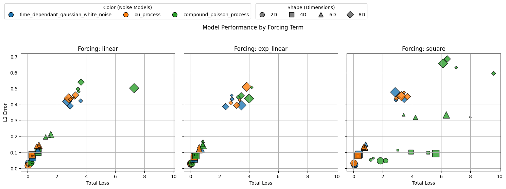
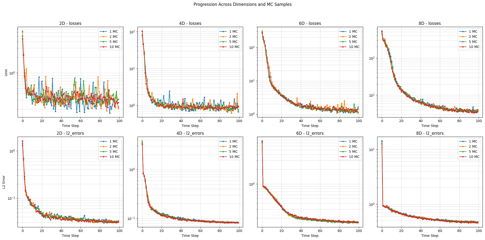
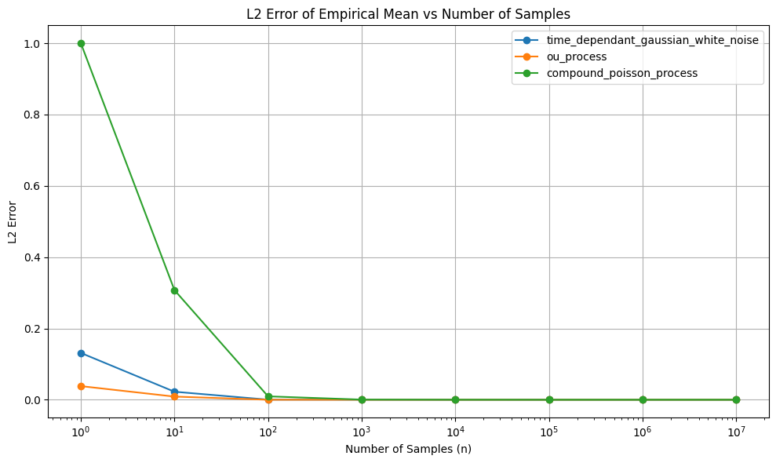

# Chaos into Order: Neural Framework for Expected Value Estimation of Linear SPDEs

This repository contains the official implementation of the paper:

**Chaos into Order: Neural Framework for Expected Value Estimation of Linear Stochastic Partial Differential Equations**  
*Ísak Pétursson, María Óskarsdóttir*  

📄 [Preprint PDF](https://arxiv.org/abs/2502.03670)

---

## Overview

Stochastic Partial Differential Equations (SPDEs) describe random processes evolving over space and time, but solving them is often computationally expensive or analytically intractable.  

This project introduces the **Learned Expectation Collapser (LEC)**, a Physics-Informed Neural Network (PINN) framework designed to directly approximate the **expected value** of solutions to linear SPDEs — **without discretization**.  

### Key Features
- Physics-informed loss with PDE residuals, boundary conditions, and initial conditions.
- Stochastic forcing via multiple noise models:
  - Time-dependent Gaussian white noise
  - Ornstein–Uhlenbeck process
  - Compound Poisson process
- Supports multiple forcing types: `linear`, `exp_linear`, `square`.
- Monte Carlo residual averaging for stability.
- Scaling rules for higher-dimensional PDEs.
- TensorBoard logging and comparison plots.

---

## Repository Structure

```

.
├── LICENSE              # MIT license
├── pics/                # Figures for README and results
│   ├── loss\_curves.png
│   ├── noise\_l2\_error.png
│   └── shapes.png
├── requirements.txt     # Dependencies
├── results.csv          # Experimental results
├── results.ipynb        # Analysis and plots
├── runs/                # TensorBoard logs & saved checkpoints
├── train\_pinn.py        # Main training script
└── utils/               # Helper modules
├── lap\_utils.py
├── model\_utils.py
├── pde\_utils.py
├── sampling\_utils.py
└── viz\_utils.py

````

---

## Installation

Clone the repository and install dependencies:

```bash
git clone https://github.com/izzak98/NN-SPDE.git
cd NN-SPDE
pip install -r requirements.txt
````

Requirements include:

* Python 3.9+
* PyTorch
* NumPy
* Matplotlib
* TensorBoard
* tqdm

---

## Usage

Run training with command-line arguments:

```bash
python train_pinn.py \
    --spatial_dims 2 \
    --forcing_type exp_linear \
    --noise_function ou_process \
    --epochs 10000 \
    --m_samples 10
```

### Arguments

* `--spatial_dims` (int): number of spatial dimensions (default: 2)
* `--forcing_type` (str): `{linear, exp_linear, square}`
* `--noise_function` (str): `{time_dependant_gaussian_white_noise, ou_process, compound_poisson_process}`
* `--epochs` (int): training epochs (default: 10000)
* `--n_test` (int): test points for L2 error (default: 10000)
* `--m_samples` (int): Monte Carlo samples per PDE residual (default: 10)
* `--save_path` (str): output directory for logs (default: `runs`)

---

## Results

We ran **144 experiments** varying:

* spatial dimensions (`2, 4, 6, 8`),
* noise models (`Gaussian, OU, Poisson`),
* forcing types (`linear, exp_linear, square`),
* Monte Carlo samples (`1, 2, 5, 10`).

Main findings:

* PINNs trained with stochastic realizations converge to the **expected SPDE solution**.
* Accuracy decreases with higher dimensions, but Monte Carlo sampling improves robustness.
* Smooth noise (Gaussian, OU) yields better results than discontinuous noise (Poisson).

### Example Plots

**Model performance by forcing term:**


**Training loss & error across dimensions and MC samples:**


**Noise model comparison (L2 error):**



---

## License

MIT License. See [LICENSE](./LICENSE) for details.

